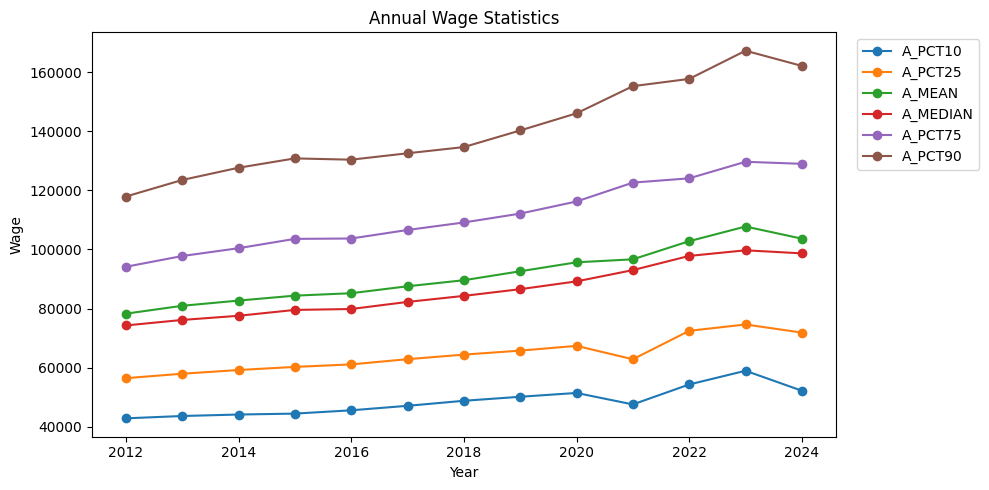
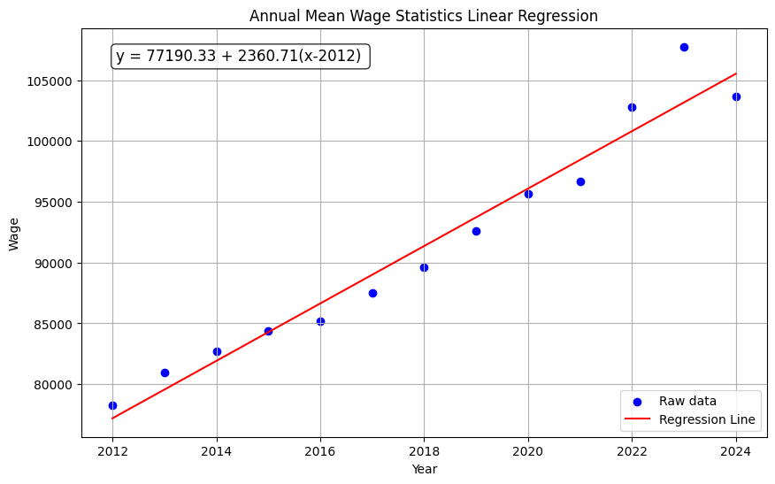
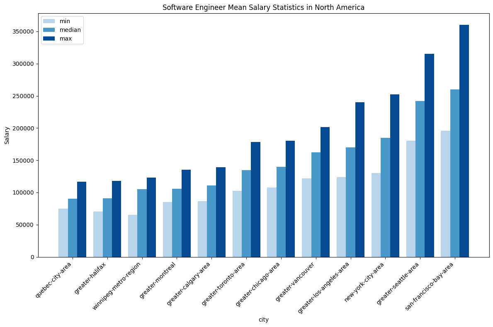
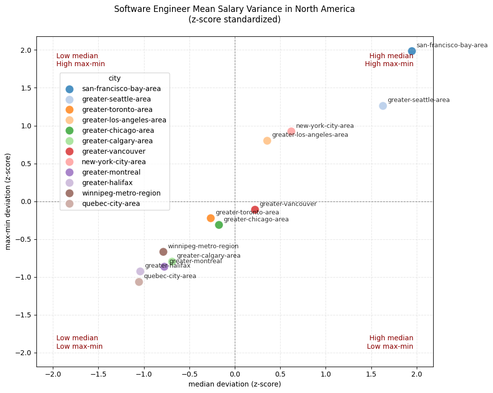
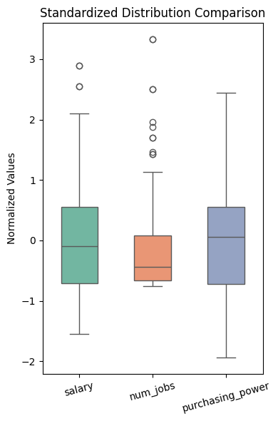
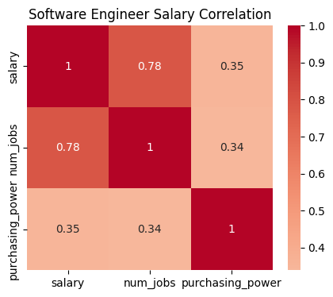

## Introduction

This project analyzes U.S. programmer salary statistics to support IT career planning, which is motivated by my recent job market research. By using data scraping techniques, I will scrape compensation data with location, year, and position details from authoritative platforms, e.g., Levels.fyi, Kaggle, and U.S. bureau of labor statistics. It aims to identify salary correlations with geographic, temporal and other factors. The findings will help professionals better understand regional compensation trends and industry dynamics, which empowers them to make data-driven, strategic career choices.

## Data sources

| Data source# | Name / short description         | Source URL                                                   | Type     | List of fields                                               | Format |
| ------------ | -------------------------------- | ------------------------------------------------------------ | -------- | ------------------------------------------------------------ | ------ |
| 1            | Annual Wage Statistics           | https://www.bls.gov/oes/tables.htm                           | file     | 1. Year<br />2. A_PCT10<br />3. A_PCT25 <br />4. A_MEAN<br />5. A_MEDIAN<br />6. A_PCT75<br />7. A_PCT90 | XLS    |
| 2            | U.S. Software Developer Salaries | https://www.kaggle.com/datasets/thedevastator/u-s-software-developer-salaries | API      | 1. city<br />2. salary<br />3. num_jobs<br />4. purchasing_power | CSV    |
| 3            | Software Engineer Salary         | https://www.levels.fyi/locations?jobFamily=Software+Engineer | Web Page | 1. city<br />2. median <br />3. min <br />4. max             | CSV    |

### 1. Annual Wage Statistics

[https://www.bls.gov/oes/tables.htm](https://www.bls.gov/oes/tables.htm)

The origin websites prohibit scrape robot, so I use alternative URL data source to make request via Python script. I collect the data from 2012 to 2024 (inclusive), each year's data is a .zip file includes a single .xlsx spreadsheet file. Then I use Python script to process those source data and combine them into a single file.

The raw file contains wage and other data of all occupancies, and I use the Computer Programmers row only for each file, I use the wage statistics only, with different quantiles and mean values. After my preprocessing, the data contains 13 years (rows), the 7 columns as follows:

1. `Year`. The number of year.
2. `A_PCT10`. Annual 10th percentile wage.
3. `A_PCT25`. Annual 25th percentile wage.
4. `A_MEDIAN`. Annual median wage (or the 50th percentile).
5. `A_PCT75`. Annual 75th percentile wage.
6. `A_PCT90`. Annual 90th percentile wage.
7. `A_MEAN`. Mean annual wage.

I name the processed data as `data_annual_wage_statistics.csv`. The top 5 rows of my collected dataset goes as follows:

| Year | A_PCT10 | A_PCT25 | A_MEAN | A_MEDIAN | A_PCT75 | A_PCT90 |
| ---- | ------- | ------- | ------ | -------- | ------- | ------- |
| 2012 | 42850   | 56440   | 78260  | 74280    | 94130   | 117890  |
| 2013 | 43640   | 57940   | 80930  | 76140    | 97760   | 123490  |
| 2014 | 44140   | 59200   | 82690  | 77550    | 100410  | 127640  |
| 2015 | 44450   | 60250   | 84360  | 79530    | 103570  | 130800  |
| 2016 | 45570   | 61100   | 85180  | 79840    | 103690  | 130360  |

### 2. U.S. Software Developer Salaries

[https://www.kaggle.com/datasets/thedevastator/u-s-software-developer-salaries](https://www.kaggle.com/datasets/thedevastator/u-s-software-developer-salaries)

I request the Kaggle API via the `kagglehub` package to download the CSV data file, and then filter the key columns from several raw similar columns.

Each row represents the salary information of a US city, and there are totally 76 cities (rows) in the data. By plotting the raw columns, I find obvious outliers of some redundant columns with similar functions, so I reserve the most stable and key columns. Then I rename the columns for shortness and convenience. Finally, I keep 4 columns as follows:

1. `city`. The name of the city.
2. `salary`. The average salary for all occupations without adjusting for cost of living differences between cities. 
3. `num_jobs`. The number of software developer jobs in the city. 
4. `purchasing_power` Average local purchasing power which can refers to discretionary spending ability. 

I name the processed data as `data_US_software_developer_salaries.csv`. The top 5 rows of my collected dataset goes as follows:

| city                 | salary | num_jobs | purchasing_power |
| -------------------- | ------ | -------- | ---------------- |
| Columbus, OH         | 108500 | 13430    | 9335.4           |
| Seattle, WA          | 131167 | 65760    | 8971.3           |
| Charlotte, NC        | 107046 | 12800    | 8939.8           |
| Colorado Springs, CO | 111670 | 5780     | 8493.1           |
| Dayton, OH           | 99338  | 4240     | 4887.7           |

### 3. Software Engineer Salary

[https://www.levels.fyi/locations?jobFamily=Software+Engineer](https://www.levels.fyi/locations?jobFamily=Software+Engineer)

The website provide up-to-date salary information of software engineer of different cities. I scrape the cities for North America, and salaries of the cities using request, BeautifulSoup package and regex expressions. The salary date of the collected data is 4/8/2025. 

> Since the webpage is updating, if you re-run the codes, you will get today's data instead of 4/8/2025. 

The raw information consists of hyper text, I filter useful information from pages and get the key information of salary distribution. After my preprocessing, the data contains 12 cities (rows), the 4 columns as follows:

1. `city`. The name of the city.
2. `median`. The median average (or the 50th percentile)
3. `min`. The low average (about 25th percentile) salary in US dollar.
4. `max`. The high average (about 75th percentile) salary in US dollar.

I name the processed data as `data_software_engineer_salary.csv`. The top 5 rows of my collected dataset goes as follows:

| city                     | median | min    | max    |
| ------------------------ | ------ | ------ | ------ |
| san-francisco-bay-area   | 260000 | 195700 | 358000 |
| greater-seattle-area     | 242000 | 180000 | 315000 |
| greater-toronto-area     | 136891 | 104002 | 180504 |
| greater-los-angeles-area | 170000 | 124000 | 240000 |
| greater-chicago-area     | 140000 | 108750 | 181000 |

## Analysis

### Trend of Annual Wages

#### Line Charts

Use the `Annual Wage Statistics` data, I plot line charts to find the tendency of wage changes as follows. It shows a slightly increase of wages totally, no matter in percentile, mean or median. Some slightly decreases can be observed, which may due to COVID-19, but it increases overall.



#### Linear Regression

Since all the feature lines acts similarly, I use the annual mean wage as the representative feature, and use linear regression to fit it, and draw it onto the scatter chart of annual mean wages as follows, which aims to find the relationship between annual mean wages and year. It finds that the wage is linear increasing, where the the annual mean wages of computer programmers start at 77190.33 in 2012, and increase 2360.71 each year.



The R2 score of the linear regression is 0.9582, which means that the annual mean wages are highly linear related with year, and thus the conclusion that wages increase as time goes by is explainable.

#### OLS Analysis

To make it more convincing, I make OLS (ordinary least squares) regression analysis as follows.

```
                            OLS Regression Results                            
==============================================================================
Dep. Variable:                 A_MEAN   R-squared:                       0.958
Model:                            OLS   Adj. R-squared:                  0.954
Method:                 Least Squares   F-statistic:                     252.1
Date:                Tue, 22 Apr 2025   Prob (F-statistic):           6.25e-09
Time:                        09:07:45   Log-Likelihood:                -116.21
No. Observations:                  13   AIC:                             236.4
Df Residuals:                      11   BIC:                             237.5
Df Model:                           1                                         
Covariance Type:            nonrobust                                         
==============================================================================
                 coef    std err          t      P>|t|      [0.025      0.975]
------------------------------------------------------------------------------
const       9.135e+04    556.290    164.221      0.000    9.01e+04    9.26e+04
Year        9193.6613    579.005     15.878      0.000    7919.279    1.05e+04
==============================================================================
Omnibus:                        4.761   Durbin-Watson:                   1.560
Prob(Omnibus):                  0.092   Jarque-Bera (JB):                2.342
Skew:                           1.022   Prob(JB):                        0.310
Kurtosis:                       3.377   Cond. No.                         1.04
==============================================================================

Notes:
[1] Standard Errors assume that the covariance matrix of the errors is correctly specified.
```

It shows that the independent variable (year) has a significant explanatory effect on the dependent variable (annual mean wages), since the Prob (F-statistic) above is very low (6.25e-09). Meanwhile, a high F-statistic (252.1) shows the linear model is effective.

### Salary distributions between cities

#### Bar Charts

To find the salary distribution between different cities, I plot the bar charts of 12 North America cities in `Software Engineer Salary` data, which shows as follow.



It shows significant differences in different cities. Intuitively, I discover that:  (1) Salary differs several times in different cities (e.g. between San Francisco Bay and Quebec); (2) When median salary increases, the gap between max salary and min salary increases as well.

#### Scatter Charts of Variance

To discover such variance, I make more statistic analysis to calculate each city's salary deviation of by (1) median salary and (2) the gap between max salary and min salary. First I calculate the mean and std of these two measurements, the results show below.

```
Mean of median : 149826.83, Std of median : 56542.81
Mean of max-min: 84501.83,  Std of max-min: 40066.90
```

Then I scatter plot visualizes the standardized deviations (z-scores) of software engineer salaries across North American cities. Each point represents a city, positioned by:

- x-axis: Median salary deviation from the mean
- y-axis: Salary range deviation (max-min) from the mean



The results shows that: (1) There is a positive correlation between the median income of urban software engineers and income disparity—the higher the median income, the greater the income gap, meaning wealth inequality becomes more pronounced.

(2) With the exception of a few cities (Greater Seattle, San Francisco Bay), the median income and income disparity in most cities fall within one standard deviation.

#### Correlation Analysis

To make the above observation more convincing, I make statistic calculations. Use three main correlation metrics, I find the relations between median salary and salary gap (max - min). The results as follow:

```
Pearson correlation coefficient: 0.9725391688567456
Spearman correlation coefficient: 0.9720279720279721
Kendall correlation coefficient: 0.909090909090909
```

1. Pearson correlation coefficient (0.973): Indicates an almost perfect linear relationship between median salary and salary range.
2. Spearman's rank correlation (0.972): Confirms that higher median salaries strongly correlate with wider salary ranges when ranked ordinally.
3. Kendall's tau (0.909): Further validates the monotonic association with high concordance in pairwise comparisons.

Therefore, cities with higher median salaries for software engineers tend to exhibit significantly greater salary dispersion (i.e., larger gaps between minimum and maximum salaries).

### U.S. Software Developer Salaries

#### Box Plot

I use `U.S. Software Developer Salaries` data to discover the relationship between salary, number of jobs and purchasing powers. The data of these 3 columns across different 76 cities (rows) are used for analysis. The Exploratory Data Statistics (EDA) calculated results as follow.

```
              salary      num_jobs  purchasing_power
count      77.000000     77.000000         77.000000
mean   101866.207792  19098.571429       7421.228571
std     13926.636588  23858.147274       1327.443694
min     80314.000000   1120.000000       4840.100000
25%     91976.000000   3170.000000       6464.200000
50%    100614.000000   8770.000000       7499.000000
75%    109503.000000  21160.000000       8153.100000
max    142101.000000  98650.000000      10673.700000
```

1. The variance of mean salary is relatively low compared, since std (13926) is significantly lower than mean (101866). And the difference between percentiles (25%, 50%, 75%) is subtle.
2. The purchasing power gap is obvious, since the minus of max (10673) and min (4840) is large. 
3. The number of jobs have significant distribution differences. A great gap appears between mean (50%) and 75% percentiles, which is 8770 and 21160. Also the max (98650) job numbers is tremendous. The large std can also prove its dramatic difference.

To make it clearly, I plot the EDA box plot results as follow (with Z-scoring).




#### Heat Map

To better examines the relationship between salary, number of jobs and purchasing powers across 76 U.S. cities, I plot the heat map as follows.



It shows that:

- Salary and job count show a strong link (r=0.78).
- salary’s impact on purchasing power is weak (r=0.35).
- Job volume has negligible influence on purchasing power (r=0.34).

So the conclusion is that, the more jobs a city provides, the higher salary it may supplies.

#### Kernel Density Estimate

Kernel Density Estimate (KDE) can be regarded as a smoothed histogram. So I plot the salary and num_jobs 2D joint KDE plots as follow.


The darkest blue region in the main plot is concentrated within the salary range of 90k–110k and job numbers of 0–20k, indicating that most cities fall within this range—a typical "mid-salary + mid-job scale" combination.

The contour lines form a ​​diagonally upward-tilted ellipse​​, confirming a ​​positive correlation​​ between salary and job numbers (consistent with your previously calculated r = 0.78).

The plot results prove the relations between salary and number of jobs.

## Summary of the results

The analysis shows a clear upward trend in software engineer salaries over time. Tech hubs like San Francisco and Seattle offer significantly higher pay but also show much wider salary gaps between top and bottom earners. Cities with more tech jobs tend to pay better, though higher salaries don't always mean greater purchasing power due to varying living costs.

For career decisions, ambitious professionals should consider high-paying tech hubs early on, while those prioritizing lifestyle may prefer cities where salaries align better with living costs. The strongest opportunities appear in cities with thriving tech job markets. Over time, salaries generally rise with industry demand, especially in established tech centers.

## How to run

Simply run all codes in the `results.ipynb`. All preparations including installing packages will be done automatically.

Pipelines:

1. Package installing.

   install package in `requirements.txt` with Python 3.13.0

2. **Data preprocessing.**

   1. Get `Software Engineer Salary` data using `kagglehub` API, no API key is needed.
   2. Get `Annual Wage Statistics` data using request scrapes. The data is unzip and combines by scripts.
   3. Get `U.S. Software Developer Salaries` data using BeautifulSoup package web scrape and analyze. The data is extracted with regex and combines by scripts.

   All the data is cleaned and filtered to keep only useful data columns. Data will be saved in `data/` after this step.

3. **Data Analyzing.**

   1. For `Annual Wage Statistics` data, explore the relationships between salary and year, using line charts, linear regression plots and OLS analysis.
   2. For `Software Engineer Salary` data, explore the relationships between salary and city, relationships between median salary and salary gap, using bar charts, scatter charts and correlation analysis.
   3. For `U.S. Software Developer Salaries` data, explore the relationships between salary and number of jobs, purchasing power, using box plot, heat map and kernel density estimate.

